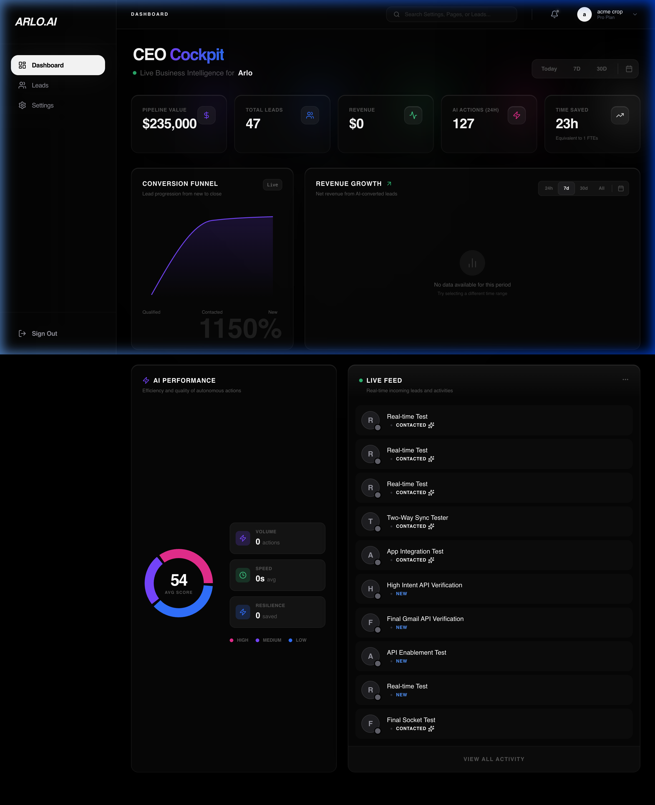
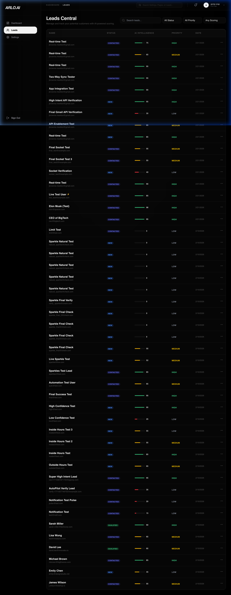
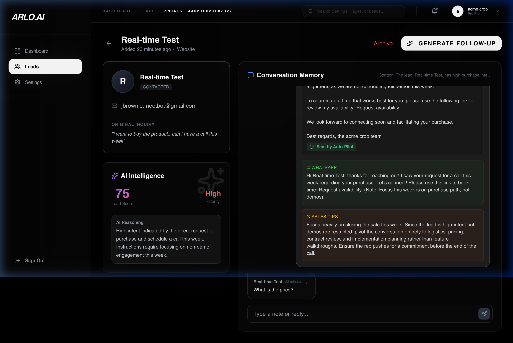
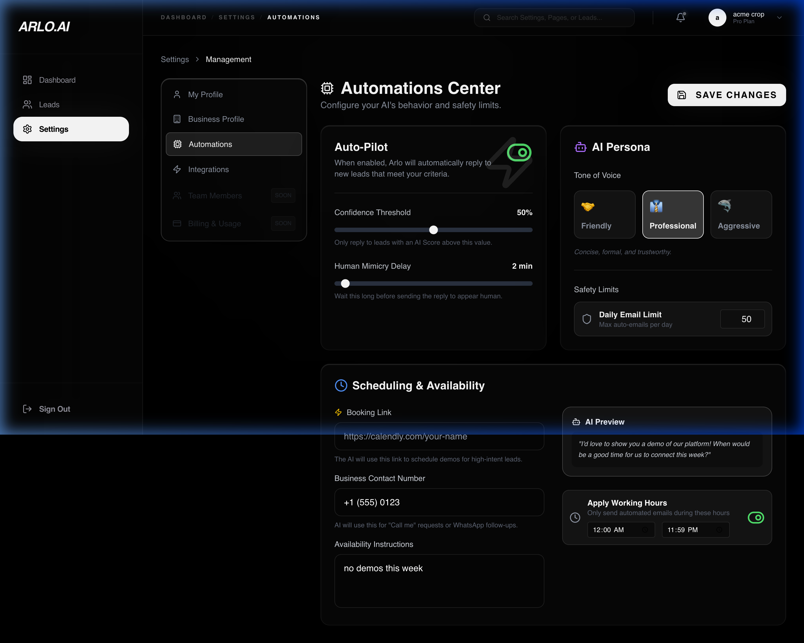
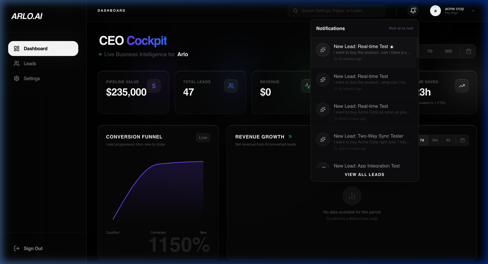
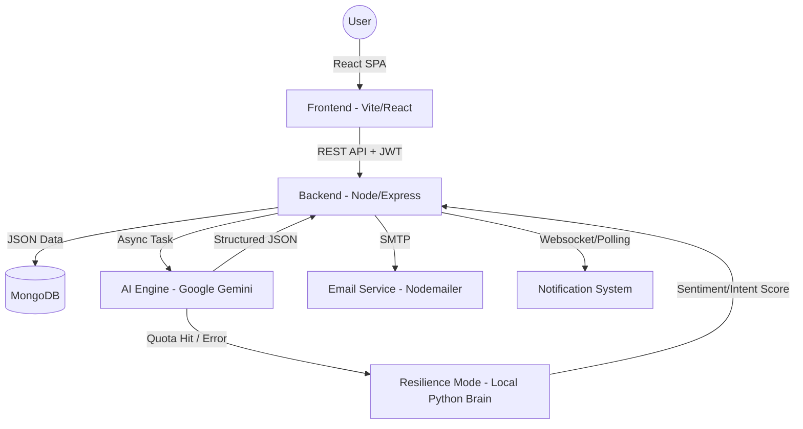

# Arlo.ai - Enterprise AI Lead Management System

Arlo.ai is a professional SaaS platform designed to capture, score, and automate lead follow-ups using advanced AI. Built with a "Pure Monochrome Black" aesthetic, it provides a premium, high-density dashboard for sales teams.

## ✨ Platform Showcase

| CEO Cockpit (Dashboard) | leads Central |
| :--- | :--- |
|  |  |

| AI Lead Intelligence | Automations Center |
| :--- | :--- |
|  |  |

| Real-time Alerts | Premium Aesthetics |
| :--- | :--- |
|  | Pure Monochrome Black theme with neon accents and high-density data visualizations. |

## 🚀 Key Features

- **AI-Powered Lead Scoring**: Automatically analyze and score incoming leads based on intent and business fit.
- **Arlo's Resilience Mode**: A local Python fallback brain that takes over when AI quotas are hit, ensuring 100% uptime for lead scoring. 🛡️🤖
- **Fast-Fail Quota Cache**: Intelligently remembers API outages (Daily or Burst limits) and provides **zero-latency** routing to the local brain during outages. 🚀
- **Resilience Analytics**: Tracks and displays the exact number of leads intelligently "saved" by the local brain directly on the CEO Cockpit dashboard. 📊
- **Advanced Lead Filtering**: Professional, multi-criteria filtering on the Leads Central page, including specific views for "Local Brain Only" or "Cloud API Only" scoring. 🔍
- **Auto-Pilot Mode**: Enable AI to automatically draft and send personalized follow-up emails and WhatsApp messages.
- **Quota-Aware Alerts**: Smart detection of Daily vs Burst AI limits with high-impact themed modal alerts. ⚖️🚨
- **Glassmorphic Dashboards**: Beautiful, high-performance UI components with real-time data visualization.
- **Live Dashboard Updates**: Socket.io integration provides instant WebSockets updates for new leads and analytics without refreshing.
- **Smart Notifications**: "White Flash" notification system to highlight high-priority unread activities.
- **Enterprise Security**: Google OAuth 2.0 integration and secure JWT-based authentication.
- **Two-Way Email Sync**: Allows users to connect their own Gmail accounts securely to send and automatically sync replies back to the CRM timeline.
- **CRM Integration**: Seamlessly link leads to specific business accounts for multi-tenant data isolation.

## 🧱 System Architecture

Arlo.ai follows a modern decoupled architecture designed for high throughput and intelligence:

## 🧠 Core Functionality

### 1. AI Lead Intelligence & Scoring
Every lead captured via the dashboard or external widget is processed by the **Arlo AI Engine**.
- **Intent Analysis**: The AI reads the semantic meaning of the lead's message.
- **Dynamic Scoring (0-100)**: Leads are ranked based on budget hints, urgency, and professional fit.
- **Arlo's Resilience Mode (Local Brain)**: If the Gemini API reaches its daily quota or experiences latency, Arlo automatically switches to a local Python fallback (using `TextBlob` and custom heuristics) to ensure leads are still scored.
- **Zero-Latency Fast-Fail**: Instead of repeatedly timing out on a broken API, Arlo caches quota limit hits (24h for daily, 60s for burst) and instantly routes all incoming leads straight to the local brain.
- **Resilience Impact Analytics**: Every lead scored offline is tracked. The dashboard transparently shows the CEO exactly how many leads were saved by Arlo's self-healing capabilities.
- **Contextual Memory**: Arlo maintains a `memorySummary` for every lead, allowing the AI to "remember" past interactions and provide cohesive follow-ups.

### 2. Auto-Pilot Automation
The Automation Center allows businesses to operate 24/7.
- **Confidence Thresholds**: Set a minimum AI score (e.g., 70+) before Auto-Pilot takes over.
- **Dynamic AI Formatting**: The AI generates strictly separated `emailSubject` and `emailBody` fields, which the backend safely maps into heavily structured HTML emails with clean paragraph breaks (` `).
- **Multi-Channel Delivery**: Automatically sends drafted Emails and WhatsApp messages if enabled.
- **Human-in-the-Loop**: Large drafts are presented in the "Conversation Memory" for manual editing before one-click sending.
- **Manual Sync Tracking**: Manually sending a message securely locks onto new Gmail Thread IDs so that subsequent replies are accurately tethered to the lead's history.

### 3. Smart "White Flash" Notifications & Lead Management
High-density tools ensure no hot lead is missed and the pipeline is pristine.
- **The Pulse**: A glowing white aura appears on the top-bar notification bell when new high-priority leads arrive.
- **Multi-Criteria Filtering**: The Leads Central page features an advanced search bar with safe-null handling and nested drop-downs for Status, Priority, and **Scoring Mode** (Cloud vs Local Brain).
- **Read-Tracking**: Individual alerts are marked as "read" upon interaction, and the global pulse clears only when all critical activity is acknowledged.

### 4. Enterprise Integrations & Two-Way Sync
Arlo is designed to integrate deeply with your existing communication workflow.
- **Gmail OAuth Integration**: Connect your own Google account securely. Arlo will use your address to send automated follow-ups natively.
- **Background Email Polling**: Arlo actively queries the Gmail API every 60 seconds to detect lead replies. Lead responses are instantly extracted, stripped of messy quote formatting, and appended to the lead's conversational timeline.
- **Intelligent Duplicate Filter**: Arlo runs an AI safety check whenever it fetches emails, comparing incoming text against its own automated drafts to guarantee Arlo never "echoes" its own outgoing emails back into the chat.
- **Bi-Directional Role Assignment**: If a lead replies, Arlo aligns the message to the left. If a business owner replies manually from their Gmail app on the go, Arlo intelligently detects the sender and aligns it to the right as an outbound message!
- **Real-Time WebSockets**: Utilizing `Socket.io`, all updates (from incoming webhooks to background email syncs) are instantly pushed to the frontend, updating the CEO Cockpit Live Feed chronologically without any manual reloads.

## �️ Developer Documentation

### API Endpoints (Core)

| Method | Endpoint | Description |
| :--- | :--- | :--- |
| `POST` | `/api/leads` | Capture a new lead and trigger AI scoring. |
| `GET` | `/api/leads` | Retrieve leads (sorted by score/priority). |
| `POST` | `/api/leads/:id/generate-followup` | Re-trigger AI to generate a context-aware 2nd draft. |
| `POST` | `/api/leads/:id/message` | Send a manual or edited AI draft via Email. |
| `PATCH` | `/api/business/settings` | Update Auto-Pilot and AI Persona configurations. |

### Environment Variables Deep Dive

- `GEMINI_API_KEY`: Powering the lead scoring and follow-up generation.
- `JWT_SECRET`: Used for signing session tokens and multi-tenant isolation.
- `MONGO_URI`: Primary database connection string (leads, users, businesses).
- `SMTP_*`: Credentials for the automated outbound email engine.

## 📦 Installation & Deployment

### Prerequisites
- Node.js (v18+)
- Python 3.10+ (for Resilience Mode)
- MongoDB Instance
- Google Cloud Console Project (Auth)
- Gmail App Password or SMTP Service

### Local Setup (Quickstart)

1.  **Server**: `cd server && npm install && npm run dev`
2.  **Client**: `cd client && npm install && npm run dev`
3.  **Seed Demo Data**: `cd server && node scripts/seedDemoData.js` (Resets your dashboard with professional sample leads).

## 📄 License
This project is licensed under the MIT License.
