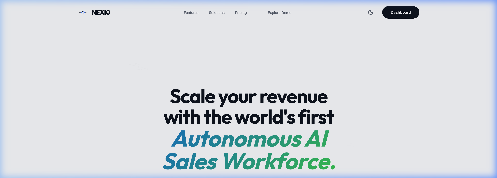
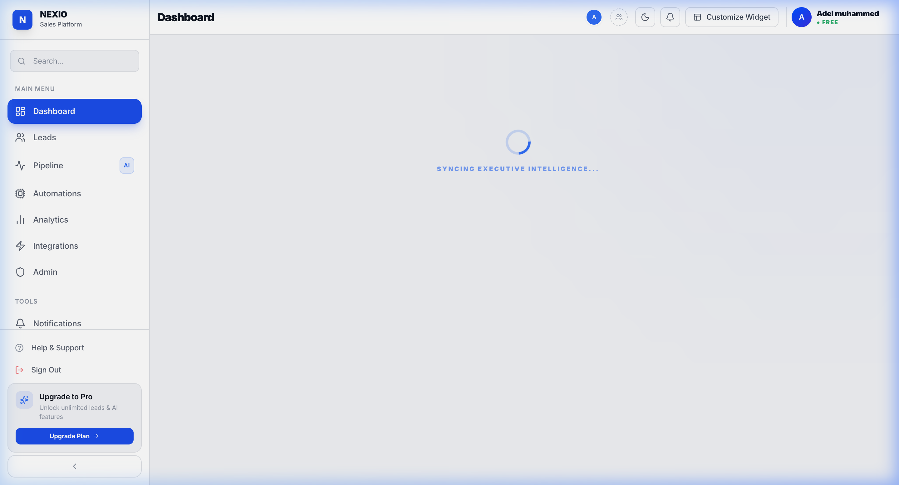
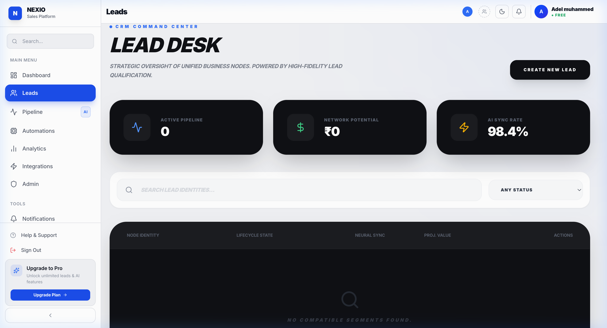
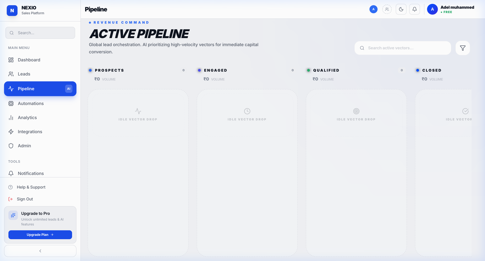
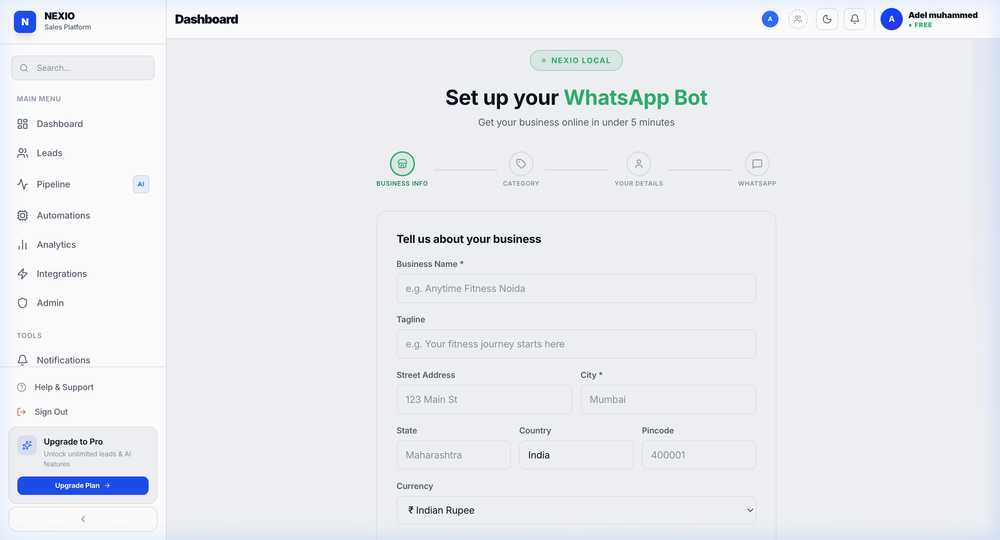
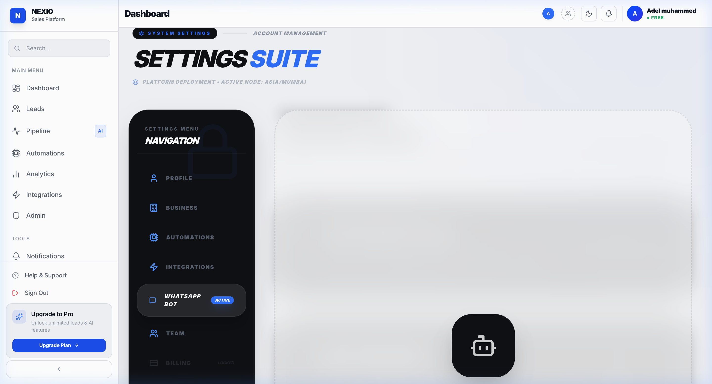
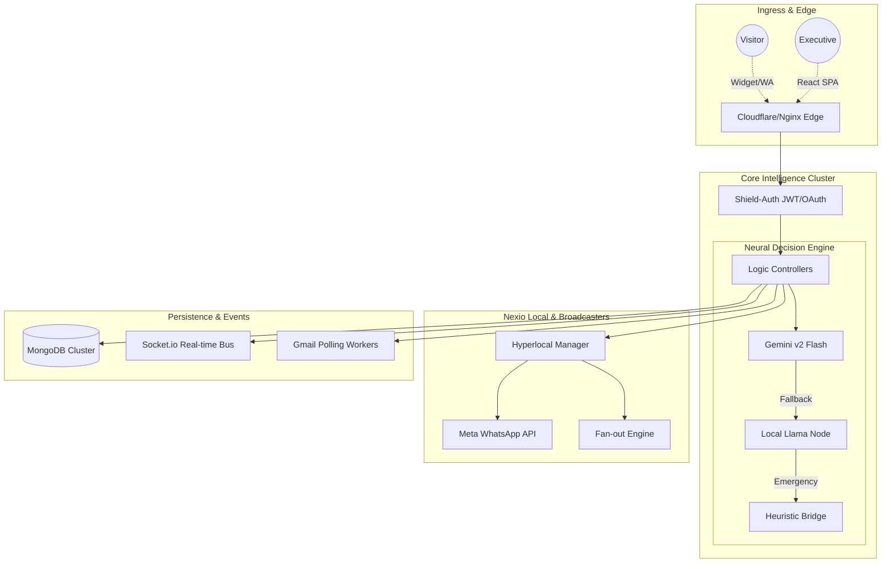
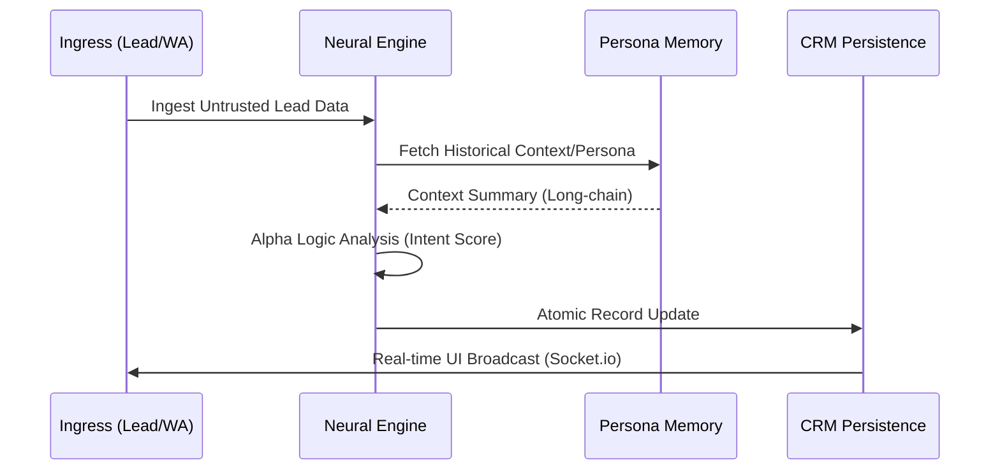

# ⚡ Nexio - Enterprise AI Lead Management System

**Nexio** is a high-density, multi-tenant AI ecosystem designed for hyper-growth sales teams. It combines professional CRM capabilities with a distributed "Neural Persona" engine that captures, scores, and automates leads across Email, WhatsApp, and Web widgets with absolute resilience.

---

## 🖼️ Platform Showcase

| 🌐 Neural Marketing Hub | 📊 Executive CEO Cockpit |
| :--- | :--- |
|  |  |

| 🎯 Lead Desk (Unified Management) | 📈 Alpha Pipeline (Orchestration) |
| :--- | :--- |
|  |  |

| 📍 Nexio Local (Hyperlocal Node) | ⚙️ WhatsApp Bot Intelligence |
| :--- | :--- |
|  |  |

---

## 🏗️ System Design & Architecture

Nexio is architected for **Massive Parallelism** and **Intelligence Redundancy**.

### 1. Unified System Topology

### 2. Multi-Tier Intelligence Flow

---

## 🚀 Key Modern Features

### 📍 Nexio Local (Hyperlocal Intelligence)
Built for local businesses (Gyms, Salons, Retail), this specialized module allows for:
- **Distributed Node Management**: Register multiple physical locations and manage them under one dashboard.
- **WhatsApp Broadcast Engine**: Fan-out targeted messages (VIPs, Active Members) with cost-per-message logic.
- **Intent-based Routing**: Inbound WhatsApp messages are analyzed for `intent` (Booking, Pricing, Support) and routed to specialized personas.

### 🧠 Alpha Logic & Neural Persona
- **Neural Persona Training**: Upload PDF knowledge bases to train the AI's "internal brain."
- **Emotional Alignment**: Configure the AI's tone (Professional, Soft, Aggressive) and response thresholds.
- **Autonomous Recovery (Resilience)**: If the cloud API hits a quota limit, the local Ollama node takes over without interrupting the lead's experience.

### 📧 Two-Way Executive Sync
- **Gmail Invisible Integration**: Background workers poll Gmail accounts to detect manual replies from owners, instantly aligning them in the CRM timeline using "Echo-Detection" to prevent looping.
- **Contextual Drafts**: AI generates high-conversion drafts for every incoming lead, ready for 1-click execution.

---

## 🛠️ Performance Tech Stack

- **Frontend**: Vite + React 18 (Client-side Routing, Framer Motion for micro-animations).
- **Backend**: Node.js 20+ (Express with structured middleware architecture).
- **AI Infrastructure**: Google AI SDK + Local Python Bridge (TextBlob, Patterns).
- **Messaging**: Meta Graph API (WhatsApp Business), Gmail API v1.
- **Persistence**: MongoDB Atlas (Transactional isolation).

---

## 📈 Engineering Roadmap & Scaling

1.  **Phase 1: Performance Node**
    - Implementation of **Redis-backed Socket.io** for multi-server synchronization.
    - Decoupling of **Gmail Sync Workers** into specialized independent containers.
2.  **Phase 2: Global Expansion**
    - Multi-region database replication for sub-50ms latency in Nexio Local.
    - **OpenTelemetry** integration for precise latency tracing across the AI bridge.
3.  **Phase 3: Parity Intelligence**
    - Fine-tuning **DeepSeek/Llama 3** local nodes to match Gemini's intent accuracy.

---

## 📄 License
Nexio is licensed under the **MIT License**. Build the future of AI CRM.
