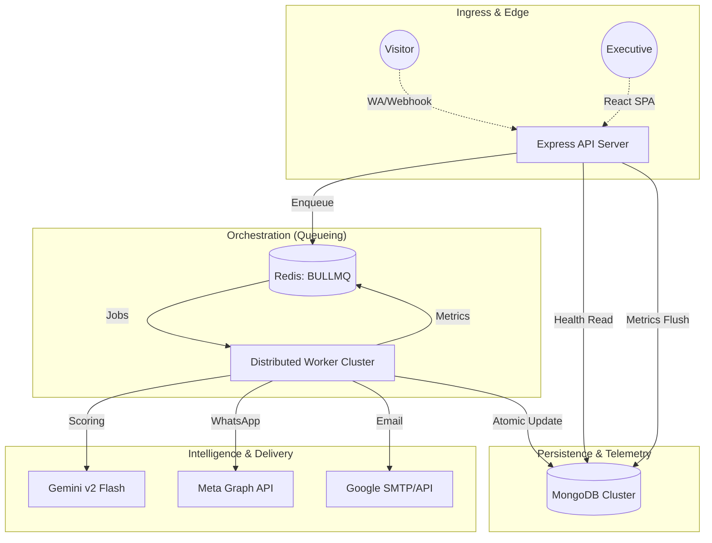

# ⚡ Nexio - Distributed AI Lead Management Engine

**Nexio** is a high-density, multi-tenant AI ecosystem designed for hyper-growth sales teams. It combines professional CRM capabilities with a distributed "Neural Persona" engine and a mission-critical asynchronous pipeline that ensures 100% side-effect reliability across Email, WhatsApp, and Web channels.

---

## 🖼️ Platform Showcase

| 🌐 Neural Marketing Hub | 📊 Executive Oversight Cockpit |
| :--- | :--- |
|  |  |

---

## 🏗️ System Design & Architecture

Nexio is architected for **Atomic Reliability** and **Distributed Execution**.

### 1. Unified System Topology (v2.6 Async)

### 2. High-Performance Execution Loop
- **Lead Intake**: Priority 1 (Sub-500ms response goal).
- **AI Processing**: Asynchronous workers scoring intent and generating response strategies.
- **Side-Effect Layer**: Idempotent dispatchers for WhatsApp/Email with Redis-backed locking.

---

## 🚀 Mission-Critical Features

### 🔐 Distributed Idempotency
Double-messaging customers is a legacy problem. Nexio uses dual-layer protection:
- **Redis Guard**: Distributed locks ensure only one worker processes an external trigger.
- **Atomic MongoDB Logic**: Database-level timestamps (`sentAt`) prevent re-execution during retry storms or worker crashes.

### 🛡️ Administrative Safety Gates
- **10s Cooldown**: High-risk actions (Purge DLQ) require a hardware-style countdown UI.
- **Mandatory Audit Logs**: Every administrative override is recorded via the `AdminAudit` system.

### 📊 Neural Pipeline Monitoring
- **Real-Time Matrix**: Monitor job counts (Waiting/Failed/Completed) for all pipelines.
- **Historical Persistence**: Metrics survive restarts via a persistent MongoDB telemetry flusher.

---

## 🛠️ Production Tech Stack

- **Core**: Node.js 20+ / Express / BullMQ / Socket.io.
- **Cache & Locks**: Redis (Queue management & Distributed locking).
- **Backend AI**: Google AI SDK (Gemini v2 Flash) + Local Python Heuristics.
- **Frontend**: Vite + React 18 / Framer Motion (Noir Executive UI).
- **Persistence**: MongoDB Atlas (Transactional isolation).

---

## 📈 Engineering Roadmap (Next Logical Phases)

1.  **Phase 1: Scale & Resilience**
    - Load testing & Chaos simulation (Target: 10k+ concurrent jobs).
    - Redis Cluster integration & Auto-scaling worker groups (K8s/ECS).
2.  **Phase 2: Global Infrastructure**
    - Multi-region database replication for globally distributed lead nodes.
    - OpenTelemetry/Jaeger integration for sub-millisecond trace visibility.
3.  **Phase 3: Monetization & Governance**
    - Credits-based AI billing engine and SaaS subscription logic.
    - Advanced audit explorer for enterprise compliance.

---

## 📄 License
Nexio is licensed under the **MIT License**. Build the future of AI CRM.
